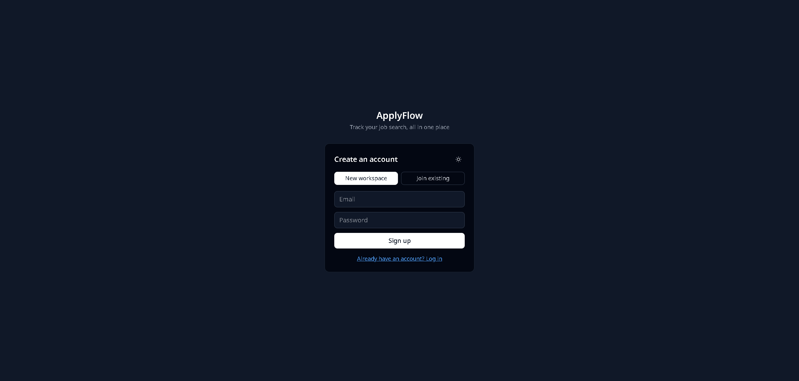
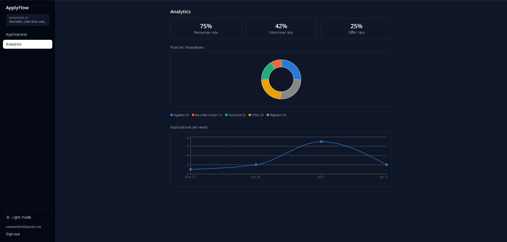
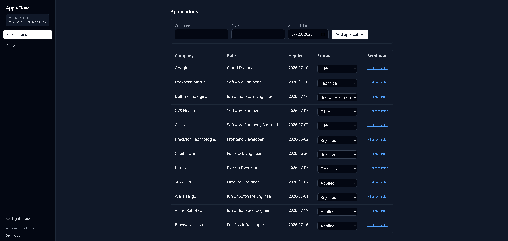
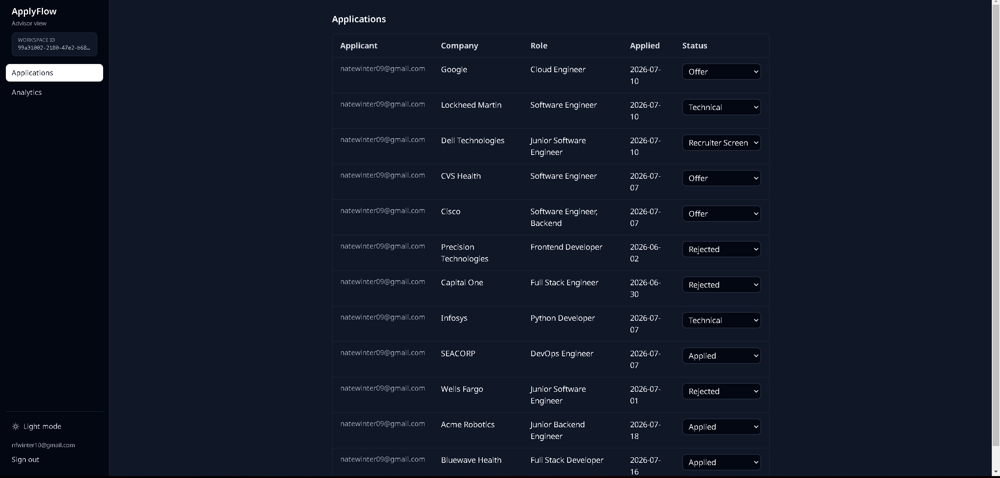
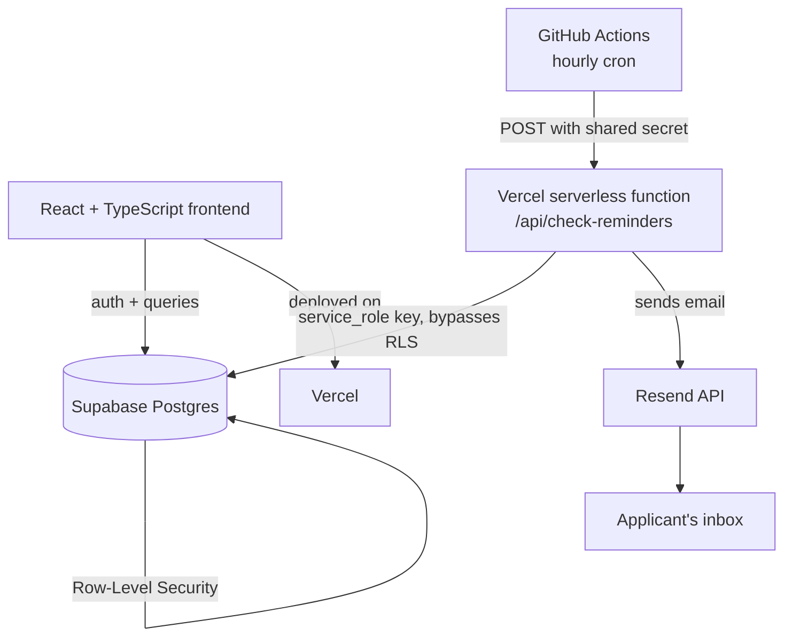

# ApplyFlow

A multi-tenant SaaS application for tracking job applications, built to demonstrate production-style patterns: role-based multi-tenancy, database-enforced access control, and automated background jobs.

**Live demo:** [nwdev-application-tracker.vercel.app](https://nwdev-application-tracker.vercel.app)

## What it does

ApplyFlow lets a job seeker track applications through a pipeline (Applied → Recruiter Screen → Technical → Offer/Rejected), view analytics on their search, and set follow-up reminders that are automatically emailed when they come due. Each user's data lives in a "workspace," and a second role — **advisor** — can be added to a workspace to review someone else's application pipeline (e.g., a career coach or mentor), without being able to see or touch any other workspace's data.

## Screenshots

### Login


### Owner dashboard — Analytics


### Owner dashboard — Applications


### Advisor view


## How it works



**Data isolation:** every table (`applications`, `workspace_members`, `reminders`, etc.) has Row-Level Security policies enforced directly in Postgres. A user's own queries are automatically scoped to their workspace and role — there's no way to accidentally leak another workspace's data through a missing `WHERE` clause in application code, because the database itself refuses the row.

**Reminders pipeline:** a GitHub Actions workflow runs every hour and calls a Vercel serverless function with a shared secret. That function uses a privileged Supabase key (server-side only, never exposed to the browser) to find due reminders across all workspaces, sends an email via Resend, and marks the reminder as sent so it isn't sent twice.

## Features

- **Authentication** via Supabase Auth (email/password)
- **Multi-tenant workspaces** with two roles: `owner` (manages their own applications) and `advisor` (views all applications in a shared workspace)
- **Row-Level Security** enforced at the database layer for tenant isolation
- **Applications CRUD** — track company, role, status, and applied date
- **Analytics dashboard** — response rate, interview rate, offer rate, pipeline breakdown (donut chart), and weekly application volume (trend line)
- **Automated reminders** — set a follow-up date per application; a scheduled job checks hourly and emails you when it's due
- **Dark mode** with persisted preference
- **Responsive design** — collapsible sidebar navigation on mobile, full sidebar on desktop

## Tech stack

**Frontend**
- React + TypeScript
- Vite
- Tailwind CSS v4
- Recharts (analytics charts)

**Backend / infrastructure**
- Supabase (Postgres database, authentication, Row-Level Security)
- Vercel (hosting + serverless functions)
- Resend (transactional email)
- GitHub Actions (scheduled background job)

## Architecture notes

- Tenant isolation is handled entirely by Postgres RLS policies, not application-level filtering — this means the guarantee holds even if a future code change forgets to add a `.eq('workspace_id', ...)` filter.
- The reminder-checking function runs with a `service_role` key specifically because it needs to read across every workspace (something a normal user-scoped key can't do under RLS) — this key is stored server-side only, in Vercel's environment variables, never sent to the browser.
- The reminder trigger endpoint is protected by a shared secret so it can't be called by anyone other than the scheduled GitHub Actions job.

## Running it locally

**Prerequisites:** Node.js, a free [Supabase](https://supabase.com) project, a free [Resend](https://resend.com) account (only needed if you want to test email sending).

1. **Clone the repo**
   ```bash
   git clone https://github.com/Winter0996/application-tracker.git
   cd application-tracker
   ```

2. **Install dependencies**
   ```bash
   npm install
   ```

3. **Set up your Supabase project**
   - Create a new project at [supabase.com](https://supabase.com)
   - In the SQL Editor, run the schema and RLS policy scripts to create the tables: `workspaces`, `workspace_members`, `applications`, `reminders`, `profiles`

4. **Configure environment variables**

   Create a `.env` file in the project root:
   ```
   VITE_SUPABASE_URL=your-supabase-project-url
   VITE_SUPABASE_ANON_KEY=your-supabase-anon-key
   ```

   For reminder email testing (optional), also add:
   ```
   SUPABASE_SERVICE_ROLE_KEY=your-service-role-key
   RESEND_API_KEY=your-resend-api-key
   CRON_SECRET=any-random-string
   ```

5. **Run the dev server**
   ```bash
   npm run dev
   ```
   Open the local URL it prints (typically `http://localhost:5173`).

6. **(Optional) Test the reminder function locally**

   The reminder-checking function lives in `/api/check-reminders.ts` and is designed to run as a Vercel serverless function. To test it after deploying to Vercel:
   ```bash
   curl -X POST https://your-deployed-url.vercel.app/api/check-reminders \
     -H "Authorization: Bearer your-cron-secret"
   ```

## Deployment

The app is deployed on Vercel with automatic deployments on push to `main`. The reminder system runs via a GitHub Actions workflow (`.github/workflows/check-reminders.yml`) on an hourly cron schedule, calling the deployed serverless function.